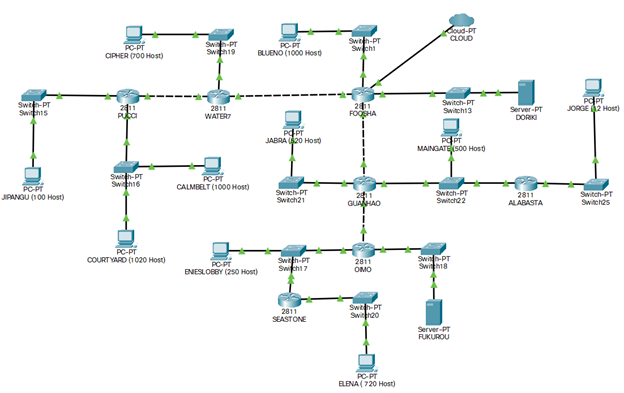
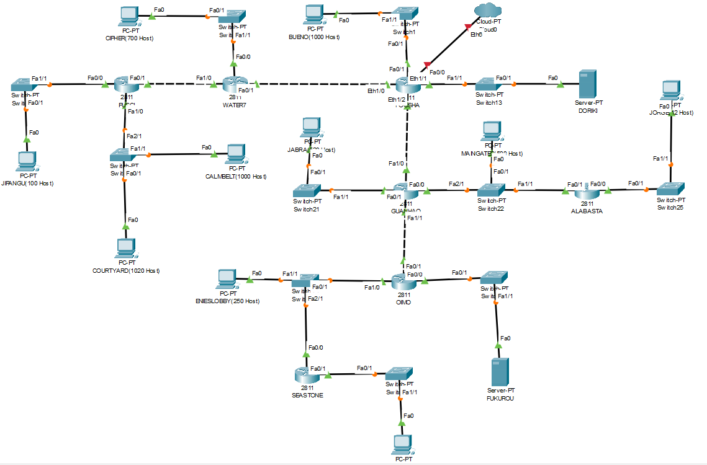
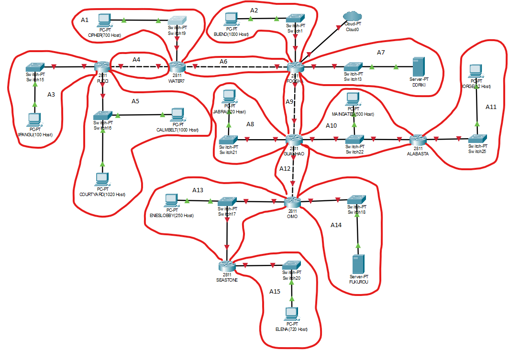
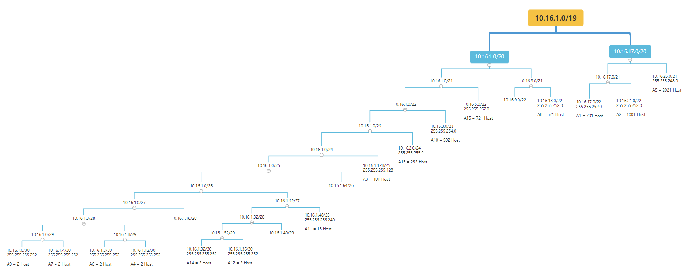
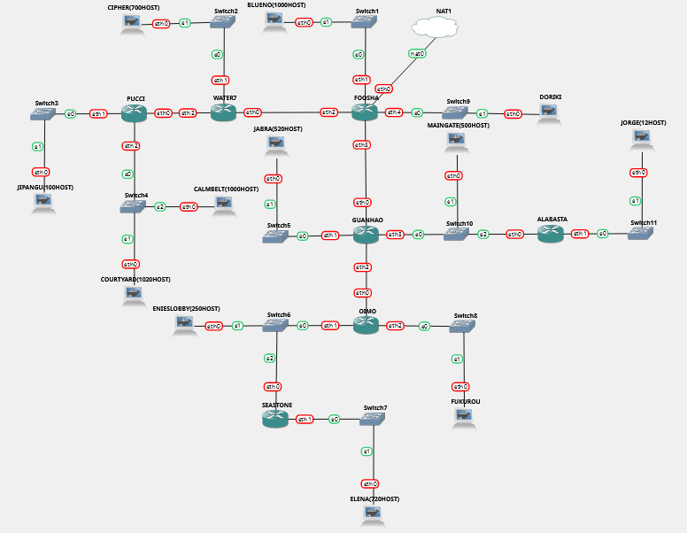
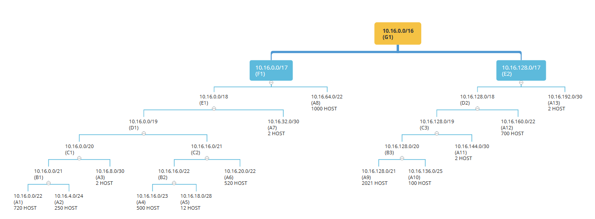

# Jarkom-Modul-4-C04-2021

Kelompok : C4

Anggota Kelompok :

- Muhammad Arif Faizin (05111940000060)
- Aufi Fillah (05111940000148)
- Abiya Sabitta Ragadani (05111940000166)

## Soal



## Variable Length Subnet Masking (VLSM) - CPT

| Subnet   | Jumlah IP   | Netmask   |
| -------- | ----------- | --------- |
| A1       | 701         | /22       |
| A2       | 1001        | /22       |
| A3       | 101         | /25       |
| A4       | 2           | /30       |
| A5       | 2021        | /21       |
| A6       | 2           | /30       |
| A7       | 2           | /30       |
| A8       | 521         | /22       |
| A9       | 2           | /30       |
| A10      | 502         | /23       |
| A11      | 13          | /28       |
| A12      | 2           | /30       |
| A13      | 252         | /24       |
| A14      | 2           | /30       |
| A15      | 721         | /22       |
| -------- | ----------- | --------- |
| TOTAL    | 5845        | /19       |



Pembagian Subnet :



Tree :



### FOOSHA

#### Interface

- FastEthernet0/0

  - IP : ``
  - Subnet Mask : ``

- FastEthernet0/1

  - IP : `10.16.21.1`
  - Subnet Mask : `255.255.252.0`

- Ethernet1/0

  - IP : `10.16.1.9`
  - Subnet Mask : `255.255.255.252`

- Ethernet1/1

  - IP : `10.16.1.5`
  - Subnet Mask : `255.255.255.252`

- Ethernet1/2

  - IP : `10.16.1.1`
  - Subnet Mask : `255.255.255.252`

- Ethernet1/3

  - IP : ``
  - Subnet Mask : ``

#### Routing

- 10.16.16.0/22 via 10.16.1.10
- 10.16.1.128/25 via 10.16.1.10
- 10.16.24.0/21 via 10.16.1.10
- 10.16.12.0/22 via 10.16.1.2
- 10.16.2.0/23 via 10.16.1.2
- 10.16.1.48/28 via 10.16.1.2
- 10.16.1.32/30 via 10.16.1.2
- 10.16.4.0/22 via 10.16.1.2

### WATER7

#### Interface

- FastEthernet0/0

  - IP : `10.16.17.1`
  - Subnet Mask : `255.255.252.0`

- FastEthernet0/1

  - IP : `10.16.1.10`
  - Subnet Mask : `255.255.255.252`

- FastEthernet1/0

  - IP : `10.16.1.13`
  - Subnet Mask : `255.255.255.252`

- FastEthernet1/1

  - IP : ``
  - Subnet Mask : ``

#### Routing

- 0.0.0.0/0 via 10.16.1.9
- 10.16.1.128/25 via 10.16.1.14
- 10.16.24.0/21 via 10.16.1.14

### PUCCI

#### Interface

- FastEthernet0/0

  - IP : `10.16.1.129`
  - Subnet Mask : `255.255.255.128`

- FastEthernet0/1

  - IP : `10.16.1.14`
  - Subnet Mask : `255.255.255.252`

- FastEthernet1/0

  - IP : `10.16.25.1`
  - Subnet Mask : `255.255.248.0`

- FastEthernet1/1

  - IP : ``
  - Subnet Mask : ``

#### Routing

- 0.0.0.0/0 via 10.16.1.13

### GUANHAO

#### Interface

- FastEthernet0/0

  - IP : `10.16.3.1`
  - Subnet Mask : `255.255.254.0`

- FastEthernet0/1

  - IP : `10.16.13.1`
  - Subnet Mask : `255.255.252.0`

- FastEthernet1/0

  - IP : `10.16.1.2`
  - Subnet Mask : `255.255.255.252`

- FastEthernet1/1

  - IP : `10.16.1.37`
  - Subnet Mask : `255.255.255.252`

#### Routing

- 0.0.0.0/0 via 10.16.1.1
- 10.16.1.48/28 via 10.16.3.2
- 10.16.1.32/30 via 10.16.1.38
- 10.16.2.0/24 via 10.16.1.38
- 10.16.4.0/22 via 10.16.1.38

### ALABASTA

#### Interface

- FastEthernet0/0

  - IP : `10.16.1.49`
  - Subnet Mask : `255.255.255.240`

- FastEthernet0/1

  - IP : `10.16.3.2`
  - Subnet Mask : `255.255.254.0`

- FastEthernet1/0

  - IP : ``
  - Subnet Mask : ``

- FastEthernet1/1

  - IP : ``
  - Subnet Mask : ``

#### Routing

- 0.0.0.0/0 via 10.16.3.1

### OIMO

#### Interface

- FastEthernet0/0

  - IP : `10.16.1.33`
  - Subnet Mask : `255.255.255.252`

- FastEthernet0/1

  - IP : `10.16.1.38`
  - Subnet Mask : `255.255.255.252`

- FastEthernet1/0

  - IP : `10.16.2.1`
  - Subnet Mask : `255.255.255.0`

- FastEthernet1/1

  - IP : ``
  - Subnet Mask : ``

#### Routing

- 0.0.0.0/0 via 10.16.1.37
- 10.16.4.0/22 via 10.16.2.2

### SEASTONE

#### Interface

- FastEthernet0/0

  - IP : `10.16.2.2`
  - Subnet Mask : `255.255.255.0`

- FastEthernet0/1

  - IP : `10.16.5.1`
  - Subnet Mask : `255.255.252.0`

#### Routing

- 0.0.0.0/0 via 10.16.2.1

### CIPHER(700 Host)

#### IP Configuration

- IP : `10.16.17.2`
- Subnet Mask : `255.255.252.0`
- Default Gateway : `10.16.17.1`
- DNS Server : `0.0.0.0`

### BLUENO(1000 Host)

#### IP Configuration

- IP : `10.16.21.2`
- Subnet Mask : `255.255.252.0`
- Default Gateway : `10.16.21.1`
- DNS Server : `0.0.0.0`

### JIPANGU(100 Host)

#### IP Configuration

- IP : `10.16.1.130`
- Subnet Mask : `255.255.255.128`
- Default Gateway : `10.16.1.129`
- DNS Server : `0.0.0.0`

### COURTYARD(1020 Host)

#### IP Configuration

- IP : `10.16.25.2`
- Subnet Mask : `255.255.248.0`
- Default Gateway : `10.16.25.1`
- DNS Server : `0.0.0.0`

### CALMBELT(1000 Host)

#### IP Configuration

- IP : `10.16.25.3`
- Subnet Mask : `255.255.248.0`
- Default Gateway : `10.16.25.1`
- DNS Server : `0.0.0.0`

### DORIKI(Server)

#### IP Configuration

- IP : `10.16.1.6`
- Subnet Mask : `255.255.255.255`
- Default Gateway : `10.16.1.4`
- DNS Server : `0.0.0.0`

### JABRA(520 Host)

#### IP Configuration

- IP : `10.16.13.2`
- Subnet Mask : `255.255.252.0`
- Default Gateway : `10.16.13.1`
- DNS Server : `0.0.0.0`

### MAINGATES(500 Host)

#### IP Configuration

- IP : `10.16.3.3`
- Subnet Mask : `255.255.254.0`
- Default Gateway : `10.16.3.1`
- DNS Server : `0.0.0.0`

### JORGE(12 Host)

#### IP Configuration

- IP : `10.16.1.50`
- Subnet Mask : `255.255.255.240`
- Default Gateway : `10.16.1.49`
- DNS Server : `0.0.0.0`

### ENIESLOBBY(250 Host)

#### IP Configuration

- IP : `10.16.2.3`
- Subnet Mask : `255.255.255.0`
- Default Gateway : `10.16.2.1`
- DNS Server : `0.0.0.0`

### FUKUROU(Server)

#### IP Configuration

- IP : `10.16.1.34`
- Subnet Mask : `255.255.255.252`
- Default Gateway : `10.16.1.33`
- DNS Server : `0.0.0.0`

### ELENA(720 Host)

#### IP Configuration

- IP : `10.16.5.2`
- Subnet Mask : `255.255.252.0`
- Default Gateway : `10.16.5.1`
- DNS Server : `0.0.0.0`

## Classless Inter Domain Routing (CIDR) - GNS3

| Subnet | Host                 | Jumlah IP   | Netmask |
| ------ | -------------------- | ----------- | ------- |
| A1     | ELENA                | 720         | /22     |
| A2     | ENIESLOBBY           | 250         | /24     |
| A3     | SEASTONE + OIMO      | 2           | /30     |
| A4     | MAINGATE             | 500         | /23     |
| A5     | JORGE                | 12          | /28     |
| A6     | JABRA                | 520         | /22     |
| A7     | GUANHAO + FOOSHA     | 2           | /30     |
| A8     | BLUENO               | 1000        | /22     |
| A9     | CALMBELT + COURTYARD | 1000 + 1020 | /21     |
| A10    | JIPANGU              | 100         | /25     |
| A11    | PUCCI + WATER7       | 2           | /30     |
| A12    | CIPHER               | 700         | /22     |
| A13    | WATER7 + FOOSHA      | 2           | /30     |






### ELENA

```
auto eth0
iface eth0 inet static
address 10.16.0.2
netmask 255.255.252.0
gateway 10.16.0.1
```

### SEASTONE

```
auto lo
iface lo inet loopback

auto eth0
iface eth0 inet static
address 10.16.4.2
netmask 255.255.255.0
gateway 10.16.4.1

auto eth1
iface eth1 inet static
address 10.16.0.1
netmask 255.255.252.0
```


### ENIESLOBBY

```
auto eth0
iface eth0 inet static
address 10.16.4.3
netmask 255.255.255.0
gateway 10.16.4.1
```

### OIMO

```
auto lo
iface lo inet loopback

auto eth0
iface eth0 inet static
address 10.16.8.2
netmask 255.255.255.252
gateway 10.16.8.1

auto eth1
iface eth1 inet static
address 10.16.4.1
netmask 255.255.255.0
```

Kemudian jalankan
```
route add -net 10.16.0.0 netmask 255.255.248.0 gw 10.16.4.3

route add -net 10.16.0.0 netmask 255.255.248.0 gw 10.16.4.2
```
Sebagai routing

### JABRA

```
auto eth0
iface eth0 inet static
address 192.168.20.2
netmask 255.255.252.0
gateway 192.168.20.1
```

### JORGE

```
auto eth0
iface eth0 inet static
address 10.16.18.2
netmask 255.255.255.240
gateway 10.16.18.1
```

### ALABASTA

```
auto lo
iface lo inet loopback

auto eth0
iface eth0 inet static
address 10.16.16.2
netmask 255.255.254.0
gateway 10.16.16.1

auto eth1
iface eth1 inet static
address 10.16.18.1
netmask 255.255.255.240
```

### MAINGATE

```
auto eth0
iface eth0 inet static
address 10.16.16.3
netmask 255.255.254.0
gateway 10.16.16.1
```

### GUANHAO

```
auto lo
iface lo inet loopback

auto eth0
iface eth0 inet static
address 10.16.32.2
netmask 255.255.255.252
gateway 10.16.32.1

auto eth1
iface eth1 inet static
address 10.16.20.1
netmask 255.255.252.0

auto eth2
iface eth2 inet static
address 10.16.8.1
netmask 255.255.255.252

auto eth3
iface eth3 inet static
address 10.16.16.1
netmask 255.255.254.0
```

Kemudian Jalankan
```
route add -net 10.16.16.0 netmask 255.255.252.0 gw 10.16.16.3

route add -net 10.16.16.0 netmask 255.255.252.0 gw 10.16.16.2

route add -net 10.16.20.0 netmask 255.255.252.0 gw 10.16.20.2

route add -net 10.16.0.0 netmask 255.255.240.0 gw 10.16.8.2
```
Sebagai Routing

### JIPANGU

```
auto eth0
iface eth0 inet static
address 10.16.136.2
netmask 255.255.255.128
gateway 10.16.136.1
```

### CALMBELT

```
auto eth0
iface eth0 inet static
address 10.16.128.2
netmask 255.255.248.0
gateway 10.16.128.1
```

### COURTYARD

```
auto eth0
iface eth0 inet static
address 10.16.128.3
netmask 255.255.248.0
gateway 10.16.128.1
```

### PUCCI

```
auto lo
iface lo inet loopback

auto eth0
iface eth0 inet static
address 10.16.144.2
netmask 255.255.255.252
gateway 10.16.144.1

auto eth1
iface eth1 inet static
address 10.16.136.1
netmask 255.255.255.128

auto eth2
iface eth2 inet static
address 10.16.128.1
netmask 255.255.248.0
```

### CIPHER

```
auto eth0
iface eth0 inet static
address 10.16.160.2
netmask 255.255.252.0
gateway 10.16.160.1
```

### WATER7

```
auto lo
iface lo inet loopback

auto eth0
iface eth0 inet static
address 10.16.192.2
netmask 255.255.255.252
gateway 10.16.192.1

auto eth1
iface eth1 inet static
address 10.16.160.1
netmask 255.255.252.0

auto eth2
iface eth2 inet static
address 10.16.144.1
netmask 255.255.255.252
```

Kemudian Jalankan
```
route add -net 10.16.160.0 netmask 255.255.252.0 gw 10.16.160.2

route add -net 10.16.128.0 netmask 255.255.224.0 gw 10.16.144.2
```

Sebagai routing

### BLUENO

```
auto eth0
iface eth0 inet static
address 10.16.64.2
netmask 255.255.252.0
gateway 10.16.64.1
```

### FOOSHA

```
auto lo
iface lo inet loopback

auto eth0
iface eth0 inet dhcp

auto eth1
iface eth1 inet static
address 10.16.64.1
netmask 255.255.252.0

auto eth2
iface eth2 inet static
address 10.16.192.1
netmask 255.255.255.252

auto eth3
iface eth3 inet static
address 10.16.32.1
netmask 255.255.255.252
```

Kemudian Jalankan
```
route add -net 10.16.64.0 netmask 255.255.252.0 gw 10.16.64.2

route add -net 10.16.128.0 netmask 255.255.128.0 gw 10.16.192.2

route add -net 10.16.0.0 netmask 255.255.192.0 gw 10.16.32.2
```
Sebagai routing


